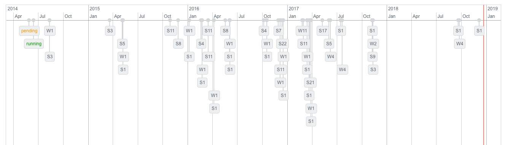
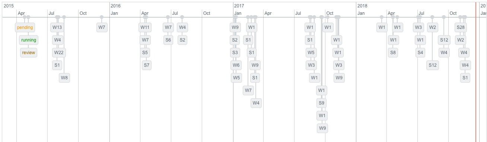

# Timeline Plots

The package contains only a subset of the most important data generated over 
a period of five years. To get an impression an overview of all annotated sample (S) and workunits (W) in the [B-Fabric](https://fgcz-bfabric.uzh.ch) system, @bfabric, is graphed in the timeline plots.

the NGS data p1644


the mass spec data p1875



# Make Data (replaces `make-data.R`)


## `NL42_100K.fastq.gz`

Sample NGS data contains 100K merged MiSeq reads that demonstrate the linkage
between nanobodies (NB) and flycodes (FC) in FASTQ.

```{r eval=FALSE}
NL42_100K <- NestLink:::.getReadsFromFastq("inst/extdata/NL42_100K.fastq.gz")
save(NL42_100K, file="inst/extdata/NestLink_NL42_100K.RData")
```

## `knownNB.txt`

An optional part of the NestLink workflow is the usage of known nanobodies
in the sequencing experiment to estimate sensitity and specificity levels. 
This example file contains nucleotide sequences of nanobodies that should be
detectable in this experiment. In the later workflow, these nanabodies are
highlighted and labeled as known NB.


## `nanobodyFlycodeLinkage.RData`
NGS ground truth derived by applying the function `runNGSAnalysis`
to the two previous files.

```{r eval=FALSE}

expFile <- query(eh, c("NestLink", "NL42_100K.fastq.gz"))[[1]]
expect_true(file.exists(expFile))
scratchFolder <- tempdir()
setwd(scratchFolder)

knownNB_File <- query(eh, c("NestLink", "knownNB.txt"))[[1]]
knownNB_data <- read.table(knownNB_File,
                           sep='\t',
                           header = TRUE,
                           row.names = 1,
                           stringsAsFactors = FALSE)

knownNB <- Biostrings::translate(DNAStringSet(knownNB_data$Sequence))
names(knownNB) <- rownames(knownNB_data)
knownNB <- sapply(knownNB, toString)

param <- list()
param[['NB_Linker1']] <- "GGCCggcggGGCC"
param[['NB_Linker2']] <- "GCAGGAGGA"
param[['ProteaseSite']] <- "TTAGTCCCAAGA"
param[['FC_Linker']] <- "GGCCaaggaggcCGG"
param[['knownNB']] <- knownNB
param[['nReads']] <- 100
param[['minRelBestHitFreq']] <- 0.8 
param[['minConsensusScore']] <- 0.9
param[['maxMismatch']] <- 1
param[['minNanobodyLength']] <- 348
param[['minFlycodeLength']] <- 33
param[['FCminFreq']] <- 1

nanobodyFlycodeLinkage.RData <- runNGSAnalysis(file = expFile[1], param)
```

## `NB.tryptic` and `FC.tryptic`

Both files are the output of the previous NGS step generating the linkage between NBs and FCs.


* https://fgcz-gstore.uzh.ch/projects/p1644/analysis_20170609_o3040/p1644o3482-4_S4.extendedFrags_uniqNB2FC.txt
* https://fgcz-gstore.uzh.ch/projects/p1644/analysis_20170609_o3040/p1644o3482-5_S5.extendedFrags_uniqNB2FC.txt


The files are used to demonstrate the detectability of the AA sequences.

The wrapper functions are extended by the SSRC prediction and the parent ion mass (pim) determined by using `r CRANpkg('protViz')`.

The column `ESP_Prediction` was generated by using the service from  https://genepattern.broadinstitute.org, see also @pmid19169245.

```{r, echo=TRUE, message=FALSE, warning=FALSE}
library(NestLink)
NB <- getNB()
FC <- getFC()
```
The first ten lines of each table is shown below:
```{r, echo=FALSE, message=FALSE, warning=FALSE}
library(knitr)
kable(head(NB))
kable(head(FC))
```

## `F255744.RData` and `WU160118.RData`

### Mass spec data

the mass spec files below are available through
[ProteomeXchange PXD009301](https://www.ebi.ac.uk/pride/archive/projects/PXD009301).


### Compute the peptide spectrum matches

the mass spectra were assigned to peptide sequences using the most  important 
parameter listed in the table
below and the Matrix Science's Mascot Server @pmid10612281 version 2.5.

|Parameter|Value|
|:---|:---|
|COM|170819_MS1708116_NL5idx4to5_Competition2BG_db8_db10_swissprot_d_merge|
|FASTA 1|[p1875_db8_20160704.fasta](http://fgcz-ms.uzh.ch/fasta/p1875_db8_20160704.fasta)|
|FASTA 2|[p1875_db10_20170817.fasta](http://fgcz-ms.uzh.ch/fasta/p1875_db10_20170817.fasta)|
|TOL|10|
|TOLU|ppm|
|ITOL|0.6| 
|ITOLU|Da|
|USERNAME|egloffp|
|CHARGE|2+|
|IT_MODS|Deamidated (NQ),Oxidation (M)|
|INSTRUMENT|ESI-TRAP|
|release|fgcz_swissprot_d_20140403.fasta|

The results were exported as XML.
The XML was parsed and exported as data.frame using `r CRANpkg('protViz')` @protViz function `protViz:::as.data.frame.mascot`.

### Workflow available through B-Fabric

The above-described results and workflows are available for registered
users in B-Fabric.
However, it is not necessary to access B-Fabric in order to use this package.

- Go to from http://fgcz-bfabric.uzh.ch

- Search for [workunit id 160118](https://fgcz-bfabric.uzh.ch/bfabric/userlab/show-workunit.html?id=160118)

- Download the [resource with id 444589](https://fgcz-bfabric.uzh.ch/bfabric/userlab/show-resource.html?id=444589)

- [p1875_db8_20160704.fasta](http://fgcz-ms.uzh.ch/fasta/p1875_db8_20160704.fasta)

- [p1875_db10_20170817.fasta](http://fgcz-ms.uzh.ch/fasta/p1875_db10_20170817.fasta)


### make-data for NestLink

The following code snippet was executed to generate the data set shiped with the
`r Biocpkg("NestLink")` package.

Here only the metadata were extracted (no MS2).

```{r eval=FALSE}
load("~/Downloads/444589.RData")
library(protViz)
library(NestLink)
WU160118 <- do.call('rbind', lapply(list("F255737", "F255744", "F255747", 
  "F255749", "F255751", "F255760", "F255761", "F255762"), 
  function(datfilename){
      df <- as.data.frame.mascot(get(datfilename))
      df$datfilename <- datfilename
      df
    }
  ))
save(WU160118, file = "../inst/extdata/WU160118.RData", 
     compress = TRUE, compression_level = 9)   
```

The data ships with the `r Biocpkg("NestLink")` package and can be browsed using 
the following code snippet:

```{r echo=TRUE, message=FALSE, warning=FALSE}

library(ExperimentHub)
eh <- ExperimentHub(); 
load(query(eh, c("NestLink", "WU160118.RData"))[[1]])
class(WU160118)
PATTERN <- "^GS[ASTNQDEFVLYWGP]{7}(WR|WLTVR|WQEGGR|WLR|WQSR)$"
idx <- grepl(PATTERN, WU160118$pep_seq)
WU <- WU160118[idx & WU160118$pep_score > 25,]
```

```{r echo=FALSE, message=FALSE, warning=FALSE}
kable(unique(unlist(lapply(strsplit(x=as.character(WU$pep_scan_title), split=";"), function(x)gsub("File:", "", gsub("\\\\", "/", x[1]))))))
```


## `PGexport2_normalizedAgainstSBstandards_Peptides.csv`

contains mass spectrometry based label free quantitative (LFQ) results of nanobodies expressed in SMEG and COLI species.

* Workunit : 158716 - QEXACTIVEHF_1

    * `20170919_16_62465_nl5idx1-3_6titratecoli.raw`
    * `20170919_05_62465_nl5idx1-3_6titratecoli.raw`

* Workunit : 158717 - QEXACTIVEHF_1

    * `20170919_14_62466_nl5idx1-3_7titratesmeg.raw`
    * `20170919_09_62466_nl5idx1-3_7titratesmeg.raw`

Two LC-MS/MS runs were aligned in Progenesis QI (Nonlinear Dynamics) with an
alignment score of 93.1 %, followed by peak picking with an allowed ion
charge of +2 to +5. 

# Uploading to S3
```
#!/bin/bash

aws --profile AnnotationContributor s3 cp NestLink/F255744.RData s3://annotation-contributor/NestLink/F255744.RData --acl public-read

aws --profile AnnotationContributor s3 cp NestLink/WU160118.RData s3://annotation-contributor/NestLink/WU160118.RData --acl public-read

aws --profile AnnotationContributor s3 cp NestLink s3://annotation-contributor/NestLink --recursive --acl public-read

```
# Overview/Getting started using Bioconductor `r Biocpkg("ExperimentHub")`

load metadata

```{r eval=TRUE}
fl <- system.file("extdata", "metadata.csv", package='NestLink')
kable(metadata <- read.csv(fl, stringsAsFactors=FALSE))
```

query and load `r Biocpkg("NestLink")` package data from aws s3

```{r echo=TRUE, message=FALSE, warning=FALSE, eval=TRUE}
library(ExperimentHub)

eh <- ExperimentHub(); 
query(eh, "NestLink")

load(query(eh, c("NestLink", "F255744.RData"))[[1]])
dim(F255744)

load(query(eh, c("NestLink", "WU160118.RData"))[[1]])
dim(WU160118)
```


# Session info

Here is the compiled output of `sessionInfo()`:

```{r sessionInfo, echo=FALSE}
sessionInfo()
```

# References
